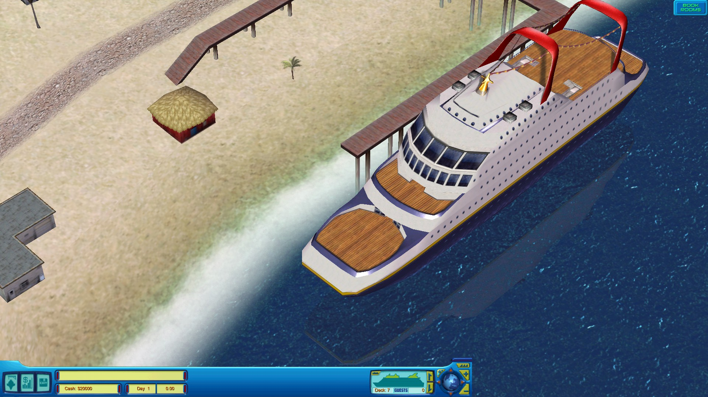

# CruiseShipTycoon-Widescreen-Patch

This patch is for Cruise Ship Tycoon (2003). It replaces the default 1280x960 (4:3) resolution with a widescreen one. The patch also fixes fixes the game's GUI to accommodate the new resolution.

To run it, open terminal in the game's folder and execute command `python .\cst_patch.py`. By default it'll try to detect the resolution of your screen and match to that, but, if on **Linux**, you'll need to install following pip package: `pip install pyautogui` (or you can define your resolution, using the arguments as explained below).

Note that the game tends to set the lowest graphical settings possible, so you might want to change your game settings. Don't forget to choose "1280x960" resolution from the game options. Also note that menu resolution and in-game resolution can be different, so the menu one is set in 4:3 ratio to avoid parts of it being cropped.

The patch accepts the following arguments:

    "path/to/the/game.exe" defines path to the game's exe (not needed if the patch is already in the game folder)
    (width)x(height) sets custom resolution
    --wide_menu (-w) sets menu resolution to be widescreen too, but the menu will get partially cropped
    --letterbox (-l) sets that 4:3 resolution which is the closest to defined widescreen resolution
    --restore (-r) restores the game exe's backup and deletes user settings, if backup file is available
    --help (-h) prints this message
