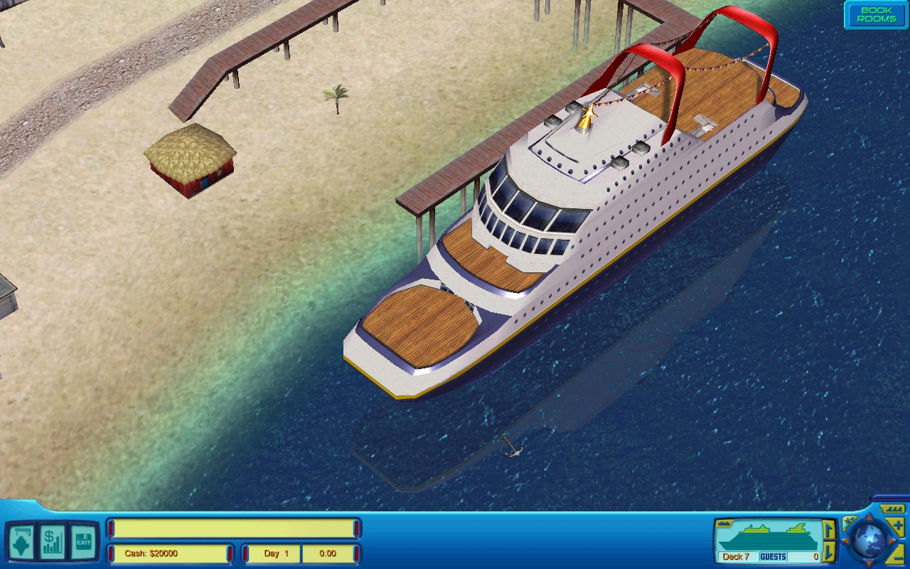
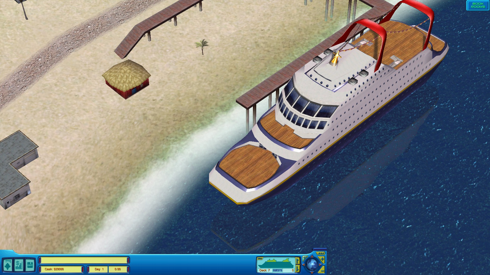
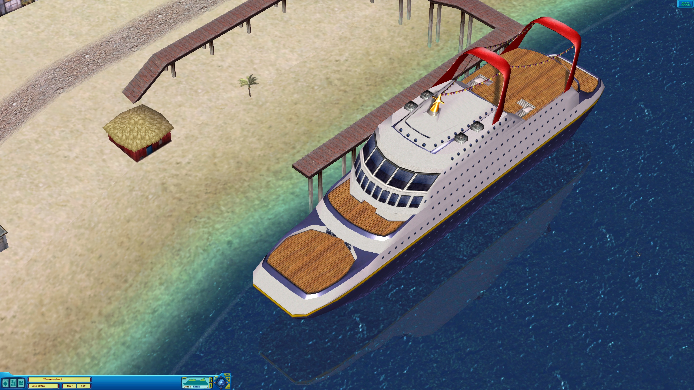
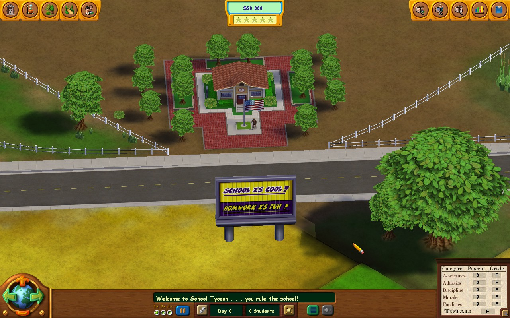
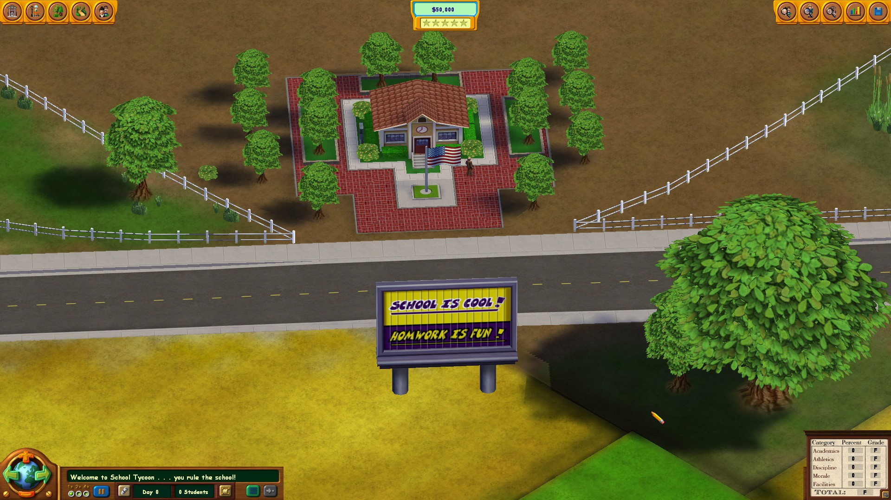
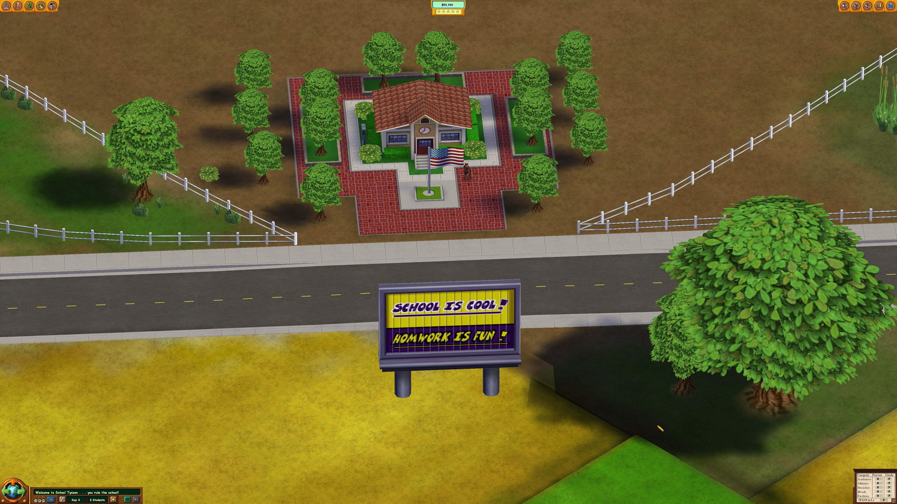

# Tycoon-Widescreen-Patches

Collection of widescreen patches I have made for selected tycoon games. 

Each patch is located in `patches` directory of the repository, it replaces the default letterbox resolution (like 1280x960) with a widescreen one.

To run a patch, download the patch you need and put it in game's folder, open terminal and execute command, for instance, `python .\cruise_patch.py` (replace with whatever patch you want to run). 

By default, it will try to detect the resolution of your screen and match to that, but, if on **Linux**, you'll need to install the following pip package: `pip install pyautogui`.

Alternatively, you can try and define custom resolution and also path to game's exe like that: `python .\cruise_patch.py "path/to/the/game.exe" 1280x800`. Run `python .\cruise_patch.py -h` to see all possible arguments. To undo the patch, run `python .\cruise_patch.py -r` to restore the unpatched exe from the backup made during patch execution. 

Each game can have its own specifics or issues, which you can check in the table of patches below. I try to eliminate all except the minor issues, so nothing game breaking. At the same time, while I tested the selected resolutions, and everything seems to work, I didn't test the games extensively. I also didn't test them under Wine (should work) or in multi-monitor configuration (you're welcome to try).

Also, look for table of examples for screenshots of the patched games in the 3 most common resolutions: 1280x800 (Steam Deck resolution), 1920x1080, 3840x2160 (4K).

## Table of patches

| Patch                                      | Resolution replaced | Game                      | Developer /  Publisher                  | Store page  | Notes and issues                                                                                                                                                                                                                                                                                                                                                                                                                                                                                                                                                                                                                                                                                                                                                                                                                                                                                                                                                                                                                                                                                                                                                                                                     |
|:-------------------------------------------|:-------------------:|:--------------------------|:--------------------------------------------|:------------|:---------------------------------------------------------------------------------------------------------------------------------------------------------------------------------------------------------------------------------------------------------------------------------------------------------------------------------------------------------------------------------------------------------------------------------------------------------------------------------------------------------------------------------------------------------------------------------------------------------------------------------------------------------------------------------------------------------------------------------------------------------------------------------------------------------------------------------------------------------------------------------------------------------------------------------------------------------------------------------------------------------------------------------------------------------------------------------------------------------------------------------------------------------------------------------------------------------------------|
| [cruise_patch.py](patches/cruise_patch.py) |      1280x960       | Cruise Ship Tycoon (2003) | Cat Daddy Games /  Activision Value     | Abandonware | 

Notes:
1) Don't forget to change game options after running the patch. 2) In-game resolution and main menu resolution can be different, so the patch chooses by default a letterbox resolution for the menu to avoid parts of the menu being cropped.
 

Noticed issues:
• When the player opens a map window, there is a black background around it. Unlike in native resolutions, it may not cover all the screen. • 4K is unstable, possibly due to the engine limitations. Might get a few tries before the game launches in 4K.

                                                                                                                                                                                                                                                                                                                                                                                                                                                                                                                                                          |
| [school_patch.py](patches/school_patch.py) |      1280x960       | School Tycoon (2004)      | Cat Daddy Games /  Global Star Software | Abandonware | 

Notes:
1) Don't forget to change game options after running the patch. 2) In-game resolution and main menu resolution are different. Menu resolution stays at 800x600 (4:3), because other resolutions don't work well with the menu. This doesn't influence in-game resolution. 3) If the game doesn't run on Windows, try Windows XP compatibility mode.
 

Noticed issues:
• In a classroom view, there is a frame with a camera icon in the bottom left corner. The frame is removed in patched resolution, because it is fixed and can't be stretched to the whole screen. The camera icon is still there, but is hidden unless the mouse hovers around it. • Save game window is also fixed in its position, so either it is a bit cropped or it doesn't cover all the screen. This doesn't influence the function of the window, all the buttons still work. • When a history window is opened with a history button press or H key, the button, if it is found to the left from the window, is not highlighted when pressed again to close the window. This doesn't influence the function of the button, it still works.

 |

## Table of examples

|                           |                              1280x800                              |                              1920x1080                               |                              3840x2160                               |
|:--------------------------|:------------------------------------------------------------------:|:--------------------------------------------------------------------:|:--------------------------------------------------------------------:|
| Cruise Ship Tycoon (2003) |  |  |  |
| School Tycoon (2003)      |       |       |       |

## Acknowledgments

As many of the tycoon games, this project started with Roller Coaster Tycoon (1999) and [jeFF0Falltrades](https://github.com/jeFF0Falltrades)'s [tutorial](https://youtu.be/cwBoUuy4nGc) on how to patch the game to support widescreen resolutions. You can also find his Python patch for the game [here](https://github.com/jeFF0Falltrades/Tutorials/tree/master/rct_full_res).

After watching the tutorial, I also remembered I played Cruise Ship Tycoon and similar tycoon games a while ago, hence my patch(es). At the same time, I didn't use the linked patch above in writing my patch(es). My mistakes are mine and mine alone. Well, mine and [ChatGPT](https://openai.com/blog/chatgpt)'s sometimes.

The tools I used: [Ghidra](https://github.com/NationalSecurityAgency/ghidra), [x64dbg](https://x64dbg.com/), [HxD](https://mh-nexus.de/en/hxd/) hex editor, and a method of [trial and error](https://en.wikipedia.org/wiki/Trial_and_error).
