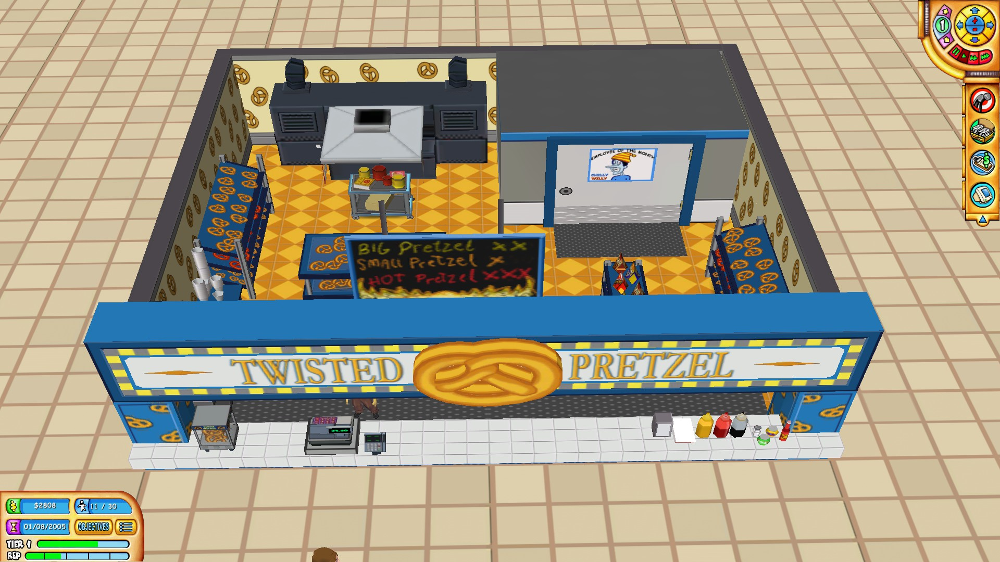

# Tycoon-Widescreen-Patch

Widescreen patch I have made for several tycoon games like Cruise Ship Tycoon from the early 2000s.

The patch replaces the default letterbox resolution (4:3) with a widescreen one (16:9, 16:10). If necessary, LAA fix (4GB patch) and HUD fixes are also applied to accommodate new resolutions.

## List of supported games & screenshots

Currently, the patch supports these games. Scroll down for the usage.

|                                            |                                         1280x800                                          |                                          1920x1080                                          |                                          3840x2160                                          |
|:-------------------------------------------|:-----------------------------------------------------------------------------------------:|:-------------------------------------------------------------------------------------------:|:-------------------------------------------------------------------------------------------:|
| Cruise Ship Tycoon (2003)                  |                         |                         |                         |
| Outdoor Life: Sportsman's Challenge (2004) |  |  |  |
| Medieval Conquest (2004)                   |                      |                      |                                                                                             |
| School Tycoon (2004)                       |                              |                              |                              |
| Ski Resort Extreme (2004)                  |                       |                       |                       |
| Mall Tycoon 3 (2005)                       |                                |                                 |                                 |
| Wildfire (2005)                            |                               |                                 |                                                                                             |

## Usage

To run a patch, install python, download [the patch](tycoon_patch.py) and put it in game's folder. Open terminal there and execute command `python .\tycoon_patch.py`.

By default, it will try to detect the resolution of your screen and match to that. If on **Linux**, you'll need to install the following pip package to do that: `pip install pyautogui`.

Alternatively, you can define resolution manually as well as game path with a command like this: `python .\tycoon_patch.py "path\to\your\game.exe" 1280x800`. Command `python .\tycoon_patch.py -h` prints help message, `python .\tycoon_patch.py -g` prints list of all supported games, whereas `python .\tycoon_patch.py -r` restores the unpatched exe from the backup made during patch execution.

Each game can have its own specifics or issues, which you can check in the list of below. First of all, there are often updates for these games online, try running updater that came with the game to update the game; or use the trusted sources (like this [Update 3](https://www.gamepressure.com/download.asp?ID=4128) for Cruise Ship Tycoon). These updates sometimes fix game crashing bugs, so my widescreen patch would often support only the latest version. I also try to eliminate all except the minor issues that arise from widescreen patch, so nothing game breaking. At the same time, while I tested the selected resolutions, and everything seems to work, I didn't test the games extensively. I also didn't test them under Wine, with ultra-widescreen resolutions or in multi-monitor configuration.

### Windowed and borderless fullscreen (DxWnd)

An issue most tycoon games here share is that alt-tabbing the game leads to graphical glitches. DxWnd is a useful tool that allows running old games windowed or borderless fullscreen, free of said glitches.

- First of all, download [DxWnd](https://sourceforge.net/projects/dxwnd/) and extract the archive anywhere you like. You will need `dxwnd.exe` later, so make a shortcut if you'd like.
- Patch your game with the resolution you need. For fullscreen, just go with the resolution of your screen. For windowed, go with resolution lower than of your screen (if you use resolution of your screen for windowed game, it won't fit your desktop, considering the taskbar). You can skip the patch and use the default letterbox resolutions (like 800x600, 1024x768, 1280x960), or patch to these: 1280x720, 1280x800, 1360x768, 1366x768, 1600x900, 1920x1080, 2560x1440, 3840x2160. You can try others, but the game may not work with some, using 640x480 resolution instead.
- Now run the `dxwnd.exe` file, drag and drop game exe on it.
- Next set up the game profile. 
- In the main section, enter the name, uncheck `Early hook`. Check `Run in Window`, `Force windowing` and `Do not notify on the task switch`, the latter prevents the game from pausing when alt-tabbing. You can also check `No banner` if you don't want to see DxWnd logo at the game startup. Finally, in the window initial position & size subsection enter zeroes for `X` and `Y`, and your resolution for `W` and `H`.

  
- In the video section, uncheck `Emulate Win Maximize`, select `Locked size` in Window size & position subsection (the game usually doesn't respond well to resizing). And in Screen resolution subsection, select `Native` and check `Limit resolution`, selecting `unlimited` there.

  
- Skip this step, if you want to run the game in windowed mode. For borderless fullscreen mode, select `modal` in the Window style subsection.

  

This should make your game more friendly to alt-tabbing. Just remember, you need to run DxWnd before running the game each time, otherwise it will just as before, without any of the DxWnd improvements. 

## List of notes and issues

| Game                                       | Developer /  Publisher                              | Store page  | Resolution replaced | Notes                                                                                                                                                                                                                                                                                                                                                                                                                                                                                                                                    | Issues                                                                                                                                                                                                                                                                                                                                                                                                                                                                                                                                                                                                                                                                                                                                       |
|:-------------------------------------------|:--------------------------------------------------------|:------------|:--------------------|:-----------------------------------------------------------------------------------------------------------------------------------------------------------------------------------------------------------------------------------------------------------------------------------------------------------------------------------------------------------------------------------------------------------------------------------------------------------------------------------------------------------------------------------------|:---------------------------------------------------------------------------------------------------------------------------------------------------------------------------------------------------------------------------------------------------------------------------------------------------------------------------------------------------------------------------------------------------------------------------------------------------------------------------------------------------------------------------------------------------------------------------------------------------------------------------------------------------------------------------------------------------------------------------------------------|
| Cruise Ship Tycoon (2003)                  | Cat Daddy Games /  Activision Value                 | Abandonware | 1280x960            | 

1) [Update 3](https://www.gamepressure.com/download.asp?ID=4128) is the latest update for the game, it is recommended for the patch. 2) Don't forget to change game options after running the patch. 3) In-game resolution and main menu resolution can be different, so the patch chooses a letterbox resolution for the menu to avoid parts of the menu being cropped.
                                                                                                                   | 

• When the player opens a map window, there is a black background around it. Unlike in native resolutions, it may not cover all the screen. • Alt-tabbing leads to graphical glitches, zoom in and out until the glitches are gone. Alternatively, use DxWnd as a workaround (see above).
                                                                                                                                                                                                                                                                                                                                                                                                          |
| Medieval Conquest (2004)                   | Cat Daddy Games /  Global Star Software             | Abandonware | 1280x960            | 

1) Patch requires the latest version of the game. If patch doesn't recognize the game, check for the updates in the game launcher. 2) Don't forget to change game options after running the patch. 3) In-game resolution and main menu resolution are different. Menu resolution stays at 800x600 (4:3), because other resolutions don't work well with the menu. This doesn't influence in-game resolution.
                                                                               | 

• Alt-tabbing leads to graphical glitches, zoom in and out until the glitches are gone. Alternatively, use DxWnd as a workaround (see above).
                                                                                                                                                                                                                                                                                                                                                                                                                                                                                                                                                          |
| Outdoor Life: Sportsman's Challenge (2004) | Cat Daddy Games /  Global Star Software             | Abandonware | 1280x960            | 

1) Patch requires the latest version of the game. If patch doesn't recognize the game, check for the updates in the game launcher. 2) Don't forget to change game options after running the patch. 3) In-game resolution and main menu resolution are different. Menu resolution stays at 800x600 (4:3), because other resolutions don't work well with the menu. This doesn't influence in-game resolution.
                                                                               | 

• Alt-tabbing leads to graphical glitches, zoom in and out until the glitches are gone. Alternatively, use DxWnd as a workaround (see above).
                                                                                                                                                                                                                                                                                                                                                                                                                                                                                                                                                          |
| School Tycoon (2004)                       | Cat Daddy Games /  Global Star Software             | Abandonware | 1280x960            | 

1) Patch requires the latest version of the game. If patch doesn't recognize the game, check for the updates in the game launcher. 2) Don't forget to change game options after running the patch. 3) In-game resolution and main menu resolution are different. Menu resolution stays at 800x600 (4:3), because other resolutions don't work well with the menu. This doesn't influence in-game resolution. 4) If the game doesn't run on Windows, try Windows XP compatibility mode.
 | 

• When a history window is opened with a history button press or H key, the button, if it is found to the left from the window, is not highlighted when pressed again to close the window. This doesn't influence the function of the button, it still works. • In a classroom view, there is a frame with a camera icon in the bottom left corner. The frame is removed in patched resolution, because it is fixed and can't be stretched to the whole screen. The camera icon is still there, but is hidden unless the mouse hovers around it. • Alt-tabbing leads to graphical glitches, zoom in and out until the glitches are gone. Alternatively, use DxWnd as a workaround (see above).
 |
| Ski Resort Extreme (2004)                  | Cat Daddy Games /  Global Star Software             | Abandonware | 1280x960            | 

1) Patch requires the latest version of the game. If patch doesn't recognize the game, check for the updates in the game launcher. 2) Don't forget to change game options after running the patch. 3) In-game resolution and main menu resolution are different. Menu resolution stays at 800x600 (4:3), because other resolutions don't work well with the menu. This doesn't influence in-game resolution.
                                                                               | 

• Alt-tabbing leads to graphical glitches, zoom in and out until the glitches are gone. Alternatively, use DxWnd as a workaround (see above).
                                                                                                                                                                                                                                                                                                                                                                                                                                                                                                                                                          |
| Mall Tycoon 3 (2005)                       | Cat Daddy Games /  Global Star Software             | Abandonware | 1280x960            | 

1) Patch requires the latest version of the game. If patch doesn't recognize the game, check for the updates in the game launcher. 2) Don't forget to change game options after running the patch.
                                                                                                                                                                                                                                                                                             | 

• None that I've noticed.
                                                                                                                                                                                                                                                                                                                                                                                                                                                                                                                                                                                                                                                                              |
| Wildfire (2005)                            | Cat Daddy Games /  Frogster Interactive Pictures AG | Abandonware | 1280x960            | 

1) Patch requires the latest version of the game. If patch doesn't recognize the game, check for the updates in the game launcher. 2) Don't forget to change game options after running the patch. 3) In-game resolution and main menu resolution are different. Menu resolution stays at 800x600 (4:3), because other resolutions don't work well with the menu. This doesn't influence in-game resolution.
                                                                               | 

• Alt-tabbing leads to graphical glitches, zoom in and out until the glitches are gone. Alternatively, use DxWnd as a workaround (see above).
                                                                                                                                                                                                                                                                                                                                                                                                                                                                                                                                                          |

## Acknowledgments

As many of the tycoon games, this project started with Roller Coaster Tycoon (1999). Specifically, with [jeFF0Falltrades](https://github.com/jeFF0Falltrades)'s [tutorial](https://youtu.be/cwBoUuy4nGc) on how to patch the game to support widescreen resolutions. You can also find his Python patch for the game [here](https://github.com/jeFF0Falltrades/Tutorials/tree/master/rct_full_res).

After watching the tutorial, I also remembered I played Cruise Ship Tycoon and similar tycoon games a while ago, hence my patch. At the same time, I didn't use the linked patch above in the writing of my patch. My mistakes are mine and mine alone. Well, mine and [ChatGPT](https://openai.com/blog/chatgpt)'s sometimes.

The tools I used: [Ghidra](https://github.com/NationalSecurityAgency/ghidra), [x64dbg](https://x64dbg.com/), [HxD](https://mh-nexus.de/en/hxd/) hex editor, and a method of [trial and error](https://en.wikipedia.org/wiki/Trial_and_error).
